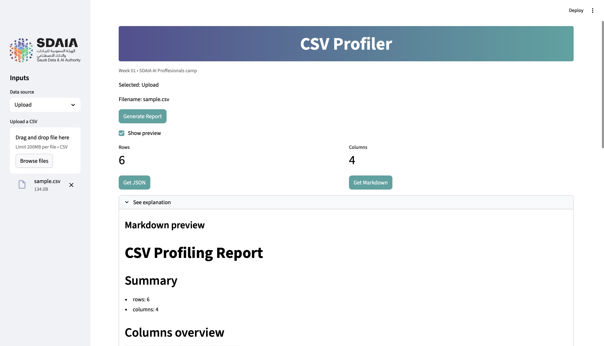

## Welcome to CSV-profiler  Tutorial


## Setup
```markdown
uv venv -p 3.11
uv pip install -r requirements.txt
```
## Run CLI
```
# If you have a src/ folder:
#   Mac/Linux: export PYTHONPATH=src
#   Windows:   $env:PYTHONPATH="src"
```
### then:
```
uv run python -m csv_profiler.cli  data/sample.csv --out-dir outputs
```

## Run GUI
```
# If you have a src/ folder:
#   Mac/Linux: export PYTHONPATH=src
#   Windows:   $env:PYTHONPATH="src"

```
### then:
```
uv run streamlit run app.py
```